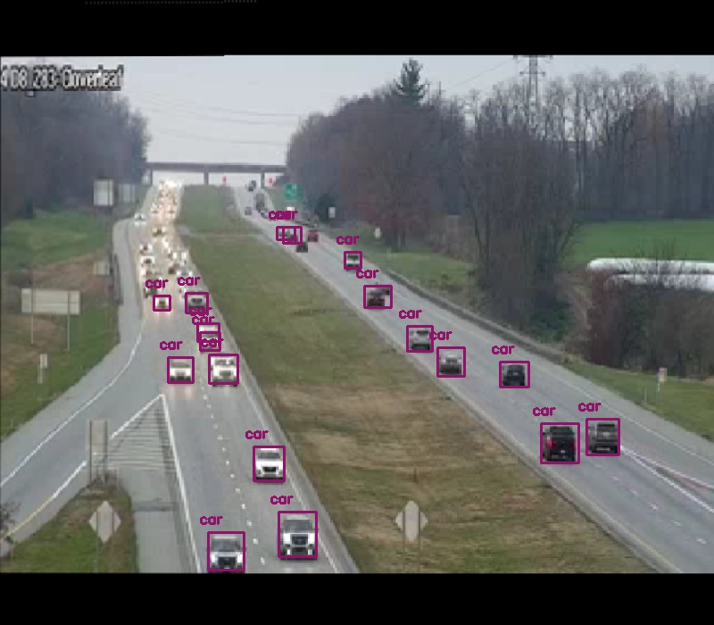

# Traffic-Density-Estimation
Implementation of deep learning based real time traffic density estimation.

## Overview
This project is a deep learning based approach to estimate the traffic density on a road in real time. Two images or video flows are feature matched and stitched together and then the total vehicles in that image/video are detected. Based on the number of vehicles, size of bounding boxes and the total occupancy of the road in that image/video frame, the traffic density is estimated for that frame.

## Concepts Utilised
* **ORB Feature Matching**
* **Image Stitching**
* **Homography matrix using RANSAC**
* **YOLOv3 object detection architecture**
* **Motion Detection using Image Substraction**

## Demo Implementation of Stitched and Object Detected Image

